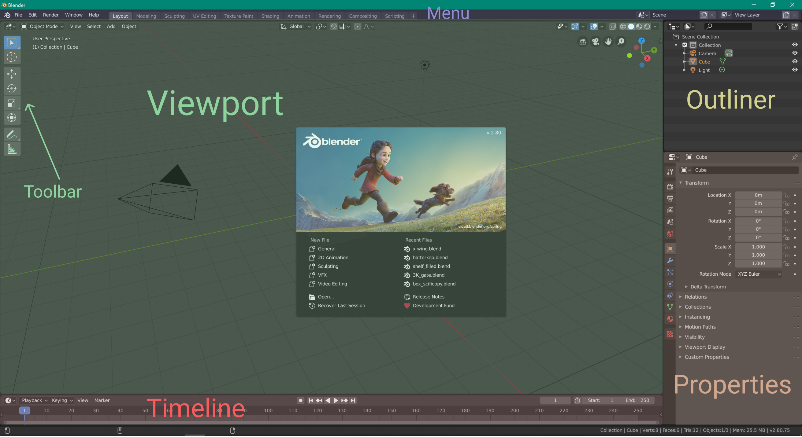
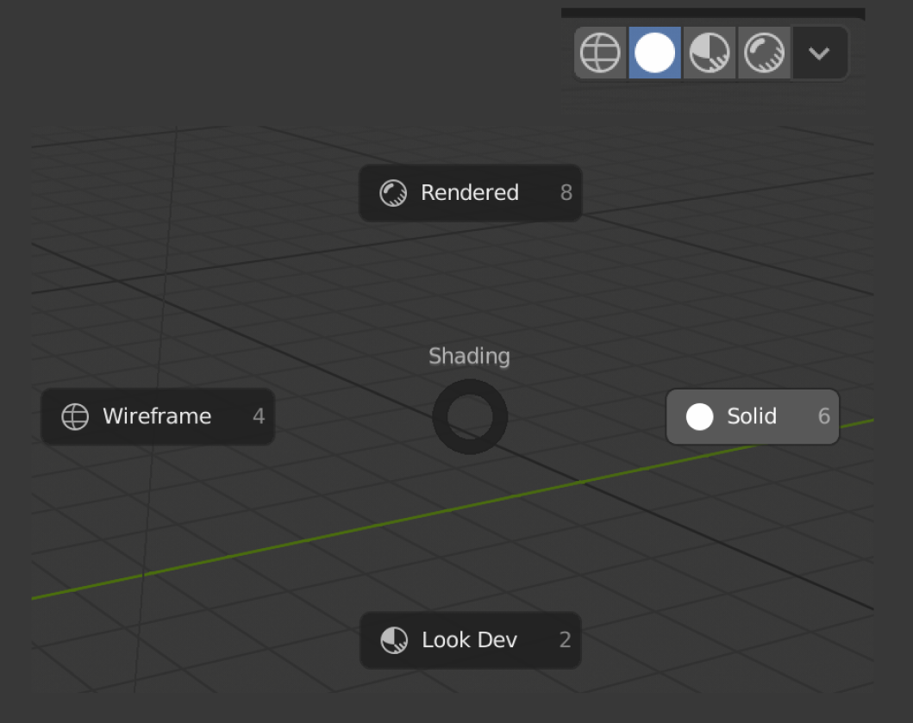
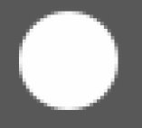
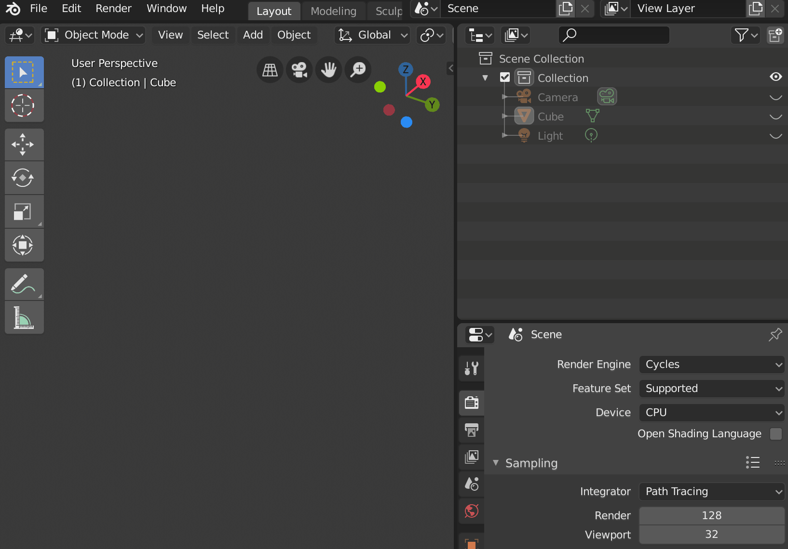
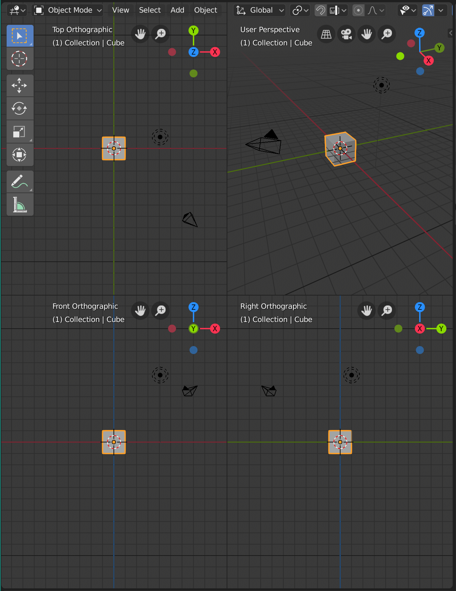
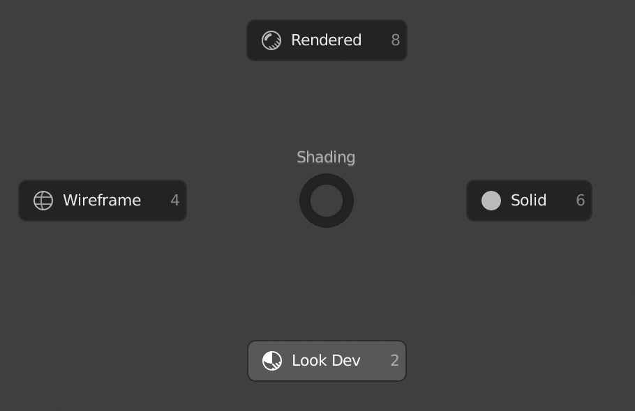
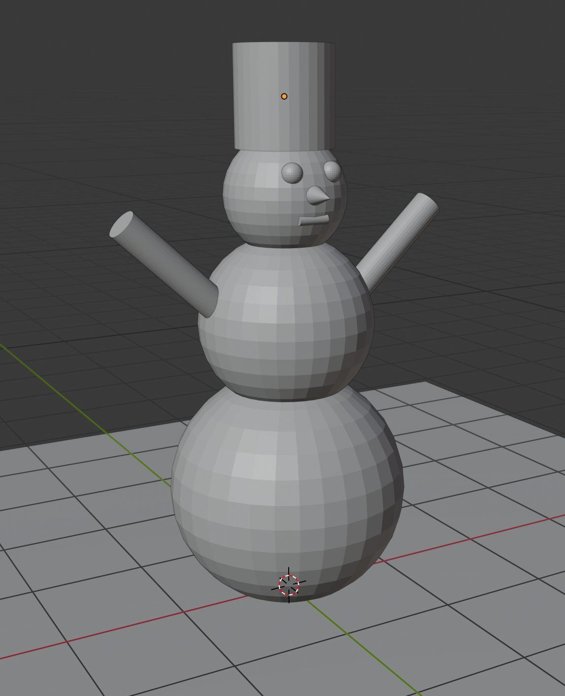
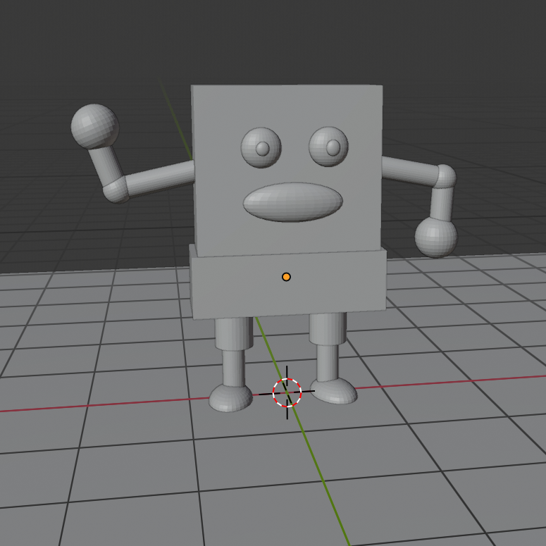

# Interfész - 1. rész

**A lecke hossza 31 percnyi videó + gyakorlás és feladatok ~1 óra**

!!! info ""
    Ez az oktatóanyag Ferenczi Róbert Magyar Blender 2.8 Tutoriál sorozatának első része alapján készült, azt kiegészítve a könnyebb kereshetőséget segítő linkekkel, a gyorsgombok gyűjteményével és néhány feladattal. Ha a leckével kapcsolatban bármi kérdésed vagy észrevételed lenne, írj a daniel.hegedus@schdesign.hu email címre, valamint ne felejtsd el likeolni a YouTube videót!

## Jelmagyarázat

!!! info "Használt jelölések"
    - gyorsgombok: ``Ctrl + Alt + Q``
    - menüpontok / eszközök nevei angolul: **Grab**
    - menüpontok / eszközök nevei magyarul: _Mozgatás_

## Kezdőknek

!!! info ""
    Először nézzétek végig a videót, majd utána fussátok át a jegyzetet, és ellenőrizzétek, hogy mennyi tudás maradt meg. Próbáljátok meg begyakorolni a jelenet körbejárásának, és az alap transzformációknak a gyorsgombjait!

### Felhasználói felület
!!! quote ""
    https://youtu.be/G8zrru587Yc?t=43

### Panelek
#### Panelek átrendezése, törlése, új panel létrehozása

!!! quote ""
    https://youtu.be/G8zrru587Yc?t=109

- átrendezés  &rarr; ``bal egérgomb`` bal a szélükre kattintva
- törlés      &rarr; ``jobb egérgomb``, majd **Join Area**
- létrehozás  &rarr; ``jobb egérgomb``, majd **Split Area**

#### Panelek tartalmának megváltoztatása 
!!! quote ""
    https://youtu.be/G8zrru587Yc?t=171

#### Panelelrendezés lementése, alap panel-elrendezés visszatöltése 
!!! quote ""
    https://youtu.be/G8zrru587Yc?t=205

- **File** &rarr; **Defaults** &rarr; **Save Startup File**
- **File** &rarr; **Defaults** &rarr; **Load Factory Settings** (Ettől még nem mentődik vissza ez alapbeállításnak, ahhoz újra a **Save Startup File**-ra kell nyomni)

### Üzemmódok váltása (**Workspace**-ek) 
!!! quote ""
    https://youtu.be/G8zrru587Yc?t=255

- **Layout**          &rarr; jelenet berendezéséhez
- **Modeling**        &rarr; Modellezés üzemmód, modellek szerkesztése
- **Sculpting**       &rarr; Szobrász üzemmód
- **UV Editing**      &rarr; UV-zás (testek 2D-be kiterítés)
- **Texture Paint**   &rarr; Textúra festés
- **Shading**         &rarr; Anyagok létrehozása (csomópont alapú)
- **Animation**       &rarr; Animáció szerkesztő üzemmód
- **Rendering**       &rarr; Renderek megtekintése
- **Compositing**     &rarr; 2D és 3D ötvözése
- **Scripting**       &rarr; Python-os programozási felület

### Viewport nézet módjai 

!!! info ""
    ``Z`` gyorsgombbal is válthatók 

!!! quote ""
    https://youtu.be/G8zrru587Yc?t=527

)

**Wireframe**  – drótvázas nézet
**Solid**  – munka nézet
**MatCap** &rarr; jobban láthatóvá teszi bizonyos részeit
**Cavity** &rarr; élek kiemelése
**Shadow** &rarr; árnyékok
**Shadeless** &rarr; árnyalás nélkül látszódjon a textúra

**LookDev**   – EEVEE engine alatt PBR anyagokat mutat

**Rendered**  – Render nézet

render engine váltás

**EEVEE** – gyorsabb

**Cycles** – fotorealisztikusabb, picit lassabb

GPU bekapcsolása &rarr; <a href='https://youtu.be/G8zrru587Yc?t=656' target='_blank' class='url'>https://youtu.be/G8zrru587Yc?t=656</a>

opcionális beállítás: <a href='https://youtu.be/G8zrru587Yc?t=710' target='_blank' class='url'>https://youtu.be/G8zrru587Yc?t=710</a> &rarr; kijelölt objektum körüli forgatás bekapcsolása/kikapcsolása

**Edit** &rarr; **Preferences** &rarr; **Navigation** &rarr; **Orbit Around Selection**

### Viewport irányítása 

https://youtu.be/G8zrru587Yc?t=757

!!! danger ""
    Ez ennek a résznek az egyik legfontosabb része, ezt elengedhetetlen tudni a továbbiakban!

<u>Objektum kijelölése</u> &rarr; ``Bal egérgomb``

<u>Nézet forgatása</u> &rarr; ``Középső egérgomb`` / gizmóval

<u>Nézet oldalaztatása</u> (**pan**) &rarr; ``Shift + Középső egérgomb``

<u>Zoomolás/nagyítás</u> &rarr; ``Középső egérgomb görgetése``

<u>Nézet átállítása a kijelölt objektumra</u> &rarr; ``NUM DEL``

(JEGYEZDMEG: ha gyanúsan nem megy a zoom, vagy elvesztél a jelenetben, akkor hasznos!)

<u>Perspektívikus</u> / <u>Ortografikus</u> üzemmód közti váltás &rarr; ``NUM 5``

Oldalsó nézetek közti váltás &rarr; ``Alt + Középső egérgombbal nézet forgatása``

<u>Előlnézet</u> &rarr; ``NUM 1``
<u>Jobboldali nézet</u> &rarr; ``NUM 3``
<u>Felülnézet</u> &rarr; ``NUM 7``
Auto Perpective kikapcsolása:
**Edit** &rarr; **Preferences** &rarr; **Navigation** &rarr; **Auto Perspective** (ezt nagyon érdemes kikapcsolni!)

**Quad View** (fixált elől-oldalt-felül és 3d nézet) &rarr; ``Alt + Ctrl + Q``

### Transzformációk 

https://youtu.be/G8zrru587Yc?t=959

**Toolbar** eszközökkel

**Grab** – <u>Mozgatás</u>

gizmókra nyomva &rarr; tengelyeken mozgatás
kis lapra nyomva &rarr; síkban mozgatás

**Rotate** – <u>Forgatás</u>

gizmókkal &rarr; adott tengely körül
fehér &rarr; nézőpontból átdögött tengely körül

**Scale** / **Cage** – <u>Átméretezés</u> / <u>Ketreccel nyújtás</u>

<u>Transzform gizmó</u> &rarr; egyszerre a 3 transzformációhoz

Gyorsbillentyűkkel

minden transzformációra

<u>Művelet visszavonása</u> &rarr; ``Jobb egérgomb``

<u>Művelet elfogadása</u> &rarr; ``Bal egérgomb``

``Shift``-et nyomva lassabban lehet mozgatni - <a href='https://youtu.be/G8zrru587Yc?t=1459' target='_blank' class='url'>https://youtu.be/G8zrru587Yc?t=1459</a>

(tengelyre korlátozás másik módja: <a href='https://youtu.be/G8zrru587Yc?t=1512' target='_blank' class='url'>https://youtu.be/G8zrru587Yc?t=1512</a>)

``G`` után ``középső egérgomb``bal irány választása

Lokális tengely mentén való transzformálás lokális tengelyekre váltás nélkül - <a href='https://youtu.be/G8zrru587Yc?t=1576' target='_blank' class='url'>https://youtu.be/G8zrru587Yc?t=1576</a>

``G + Z + Z`` &rarr; kétszer nyomva a kívánt tengelyt &rarr; tárgy lokális tengelyén mozog
``S + Shift + Z + Z`` &rarr; lokális tengely mentén nyújtás

**Grab** – ``G`` – <u>Mozgatás</u>

``X`` vagy ``Y`` vagy ``Z`` &rarr; csak az adott tengelyen
``Shift + X`` vagy ``Shift + Y`` vagy ``Shift + Z`` &rarr; mozgatás az adott tengely kizárásával (síkban mozgatás)

**Rotate** – ``R`` – <u>Forgatás</u> <a href='https://youtu.be/G8zrru587Yc?t=1281' target='_blank' class='url'>https://youtu.be/G8zrru587Yc?t=1281</a>

alapeset &rarr; nézőpontból átdöfött tengely körül
``X`` vagy ``Y`` vagy ``Z`` &rarr; adott tengely körül
szabad forgatás ``R + R``&rarr; <a href='https://youtu.be/G8zrru587Yc?t=1720' target='_blank' class='url'>https://youtu.be/G8zrru587Yc?t=1720</a>

**Scale** – ``S`` – <u>Átméretezés</u> - <a href='https://youtu.be/G8zrru587Yc?t=1340' target='_blank' class='url'>https://youtu.be/G8zrru587Yc?t=1340</a>

``X`` vagy ``Y`` vagy ``Z`` &rarr; adott tengely körül
Shift + X/Y/Z &rarr; átméretezés az adott tengely kizárásával (síkban nyújtás)

### Koordinátarendszerek 

!!! quote ""
    https://youtu.be/G8zrru587Yc?t=1159

**Globális** - <u>világ koordinátarendszer</u>
**Lokális** - <u>lokális</u>, az objektumra vonatkozó koordináta rendszer

### Objektum törlése 

!!! quote ""
    https://youtu.be/G8zrru587Yc?t=1768

**Delete** – <u>kijelölt objektum törlése</u> – ``Delete`` vagy ``X``

## Haladóknak

### Transzformációk resetelése 

!!! quote ""
    https://youtu.be/G8zrru587Yc?t=1210

!!! info ""
    Transzformációk resetelése &rarr; **N-Panel** – ``N`` 
    

Transzformációk menüpont

**Location**, **Rotation**, **Scale** (objektum eredeti helyéhez viszonított)

(minden értéket vátó felületre működő parancsok)

Mező alapértékre állítása &rarr; felettük ``Backspace``-t nyomva
Több értéksáv kijelölése &rarr; ``Shift``-el

## Transzformációs értékek elfogadása 
!!! quote ""
    https://youtu.be/G8zrru587Yc?t=1414

**Apply** – <u>Értékek elfogadása</u> – ``Ctrl+A`` &rarr; innentől ez számít alapnak (ide ugrunk vissza, ha reseteljük a transzformációkat)

**Location** – pozíció elfogadása
**Rotation** – elforgatottság elfogadása
**Scale** – átméretezettség elfogadása
**All Transforms** – mindegyik elfogadása

## Transzformációk resetelése gyorsgombbal 
!!! quote ""
    https://youtu.be/G8zrru587Yc?t=1254

Clear Location – pozíció alapértékre állítása – ``Alt + G``
Clera Rotation – forgatottság alapértékre állítása – ``Alt + R``
Clear Scale – átméretezettség alapértékre állítása – ``Alt + S``

## Tippek

!!! info "Pie Menük"
    Több olyan gyorsgomb is van, amire egy ehhez hasonló választós menü ugrik fel:
    Az ilyen fajta menüknél ha a menüt előhozó gombot (pl ``Z``) gyorsan nyomjátok le és engeditek fel, akkor megjelenve marad a menü, és csak úgy tudtok választani, ha rákattintotok ``bal egérgomb``bal a kívánt menüpontra. Azonban, ha hosszabban nyomva tartjátok a menüt előhozó gombot, és még közben ráviszitek valamelyik opcióra az egereteket, majd felengeditek a gyorsgombot, akkor ki is választódik az adott menüpont. Ez egy gyors módja a választásnak, ha már fejből tudja az ember, hogy melyik menüpont merre van. Ha mégsem akartok menüpontot választani, akkor a ``jobb egérgomb`` megnyomásával rögtön ki tudtok lépni a pie menüből. Próbáljátok ki a két verziót!

    

&nbsp;
<h2>Feladatok</h2>

Készíts el, az alábbiakhoz hasonló egyszerű primitív objektumokból álló képeket. Ehhez elég annyi plusz tudás, hogy új objektumot a ``Shift + A`` gyorsgombra felnyíló menü **Mesh** almenüje alól tudsz a jelenetedhez adni. Mozgasd, forgasd és méretezd a primitíveket, hogy megfelelő képet kapj, és a tanult módon járd körbe a jelenetet!
 

Általában nem célszerű és nem is lehetséges mindent külön primitívekből összrakni, de sokszor jó kiindulási alapot biztosítanak nekünk a primitív objektumok. A következő részekben már megismerkedünk a szerkesztési üzemmóddal, hogy saját &quot;építőelemeket&quot; készíthessünk. A fentebbi kis képek elkészítésének célja inkább az alap gyorsgombok szórakoztató begyakoroltatása volt.
